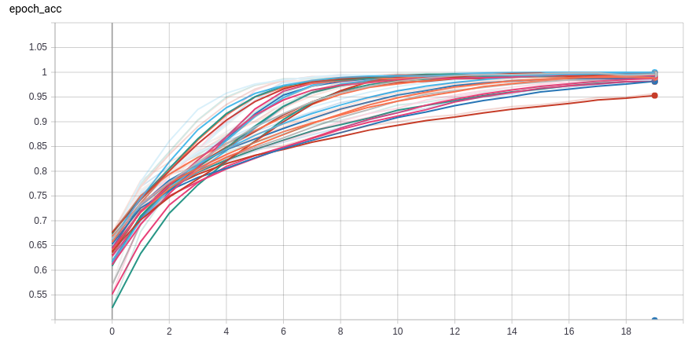
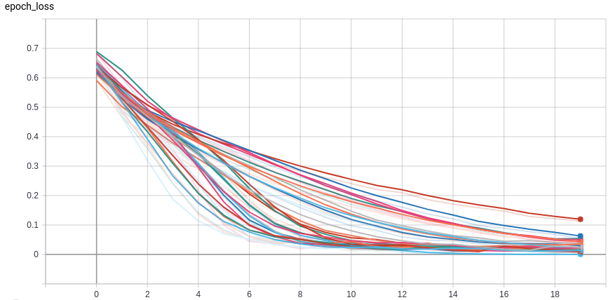
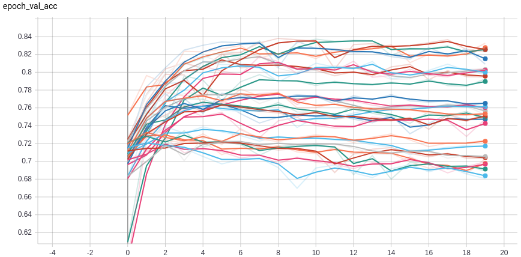
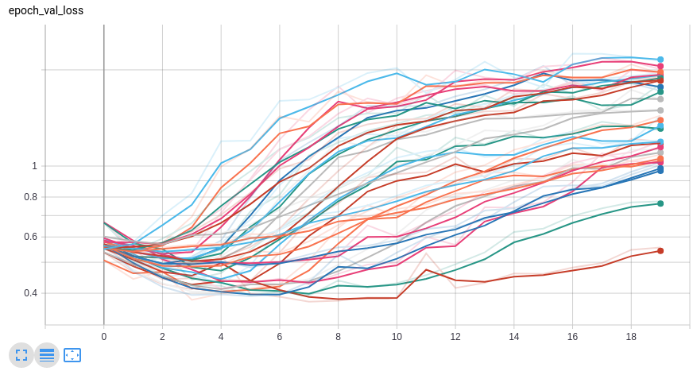

# Classifying Cats and Dogs

## Models fitted:

1. 1-conv-32-nodes-0-dense-1562556696
2. 2-conv-32-nodes-0-dense-1562556696
3. 3-conv-32-nodes-0-dense-1562556696
4. 1-conv-64-nodes-0-dense-1562556696
5. 2-conv-64-nodes-0-dense-1562556696
6. 3-conv-64-nodes-0-dense-1562556696
7. 1-conv-128-nodes-0-dense-1562556696
8. 2-conv-128-nodes-0-dense-1562556696
9. 3-conv-128-nodes-0-dense-1562556696
10. 1-conv-32-nodes-1-dense-1562556696
11. 2-conv-32-nodes-1-dense-1562556696
12. 3-conv-32-nodes-1-dense-1562556696
13. 1-conv-64-nodes-1-dense-1562556696
14. 2-conv-64-nodes-1-dense-1562556696
15. 3-conv-64-nodes-1-dense-1562556696
16. 1-conv-128-nodes-1-dense-1562556696
17. 2-conv-128-nodes-1-dense-1562556696
18. 3-conv-128-nodes-1-dense-1562556696
19. 1-conv-32-nodes-2-dense-1562556696
20. 2-conv-32-nodes-2-dense-1562556696
21. 3-conv-32-nodes-2-dense-1562556696
22. 1-conv-64-nodes-2-dense-1562556696
23. 2-conv-64-nodes-2-dense-1562556696
24. 3-conv-64-nodes-2-dense-1562556696
25. 1-conv-128-nodes-2-dense-1562556696
26. 2-conv-128-nodes-2-dense-1562556696
27. 3-conv-128-nodes-2-dense-1562556696

## Model Metrics

epoch accuracy:

epoch loss:

epoch validation accurancy:

epoch validation loss:

